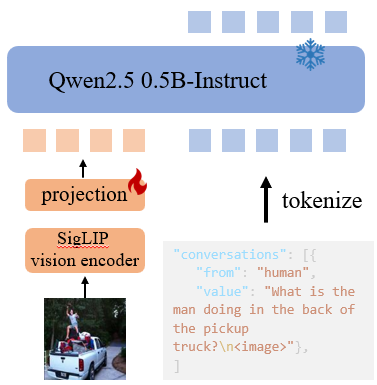
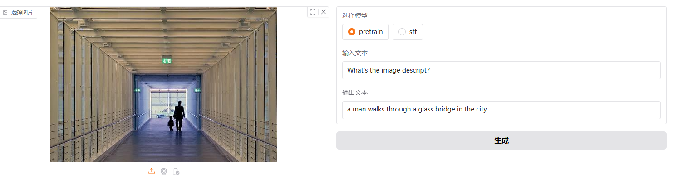
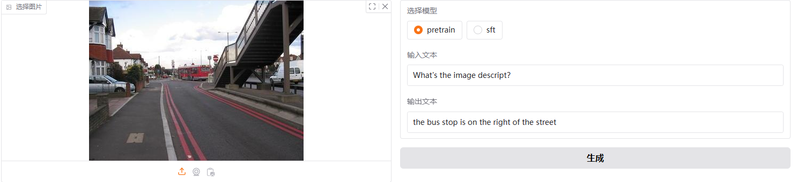
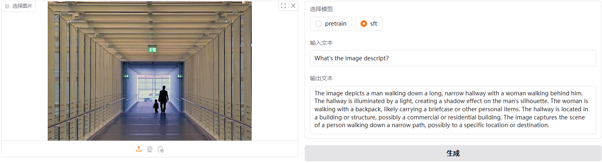
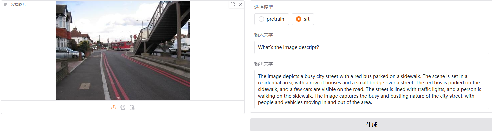
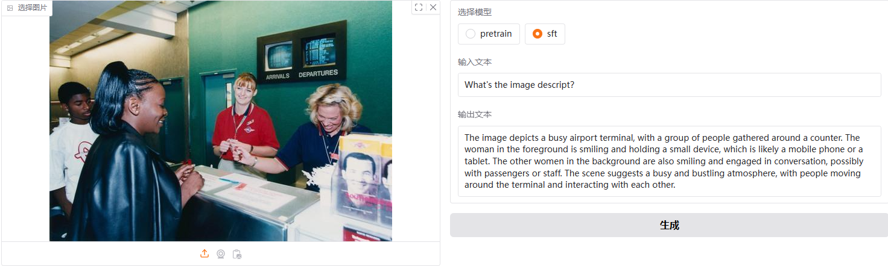

# Introduction

Mary_mllm 旨在提供一个小型多模态大语言模型，并提供一个简单可用的预训练、SFT以及DPO训练代码。
本项目模型结构，训练细节、原理等均来自以下两个项目的启发：
- [omni-vision](https://nexa.ai/blogs/omni-vision)
- [练习两周半，使用Qwen2.5-0.5B和SigLIP从零开始训练多模态大模型，从预训练到SFT完整流程，让你真正搞懂多模态大模型](https://www.bilibili.com/video/BV1HTzEYbEv3/?spm_id_from=333.1391.0.0&vd_source=9de8f05b70f1b7f369db9e085e0a9eb5)


本项目分两个训练阶段：pretrain stage: 使用 LLaVA-CC3M-Pretrain-595K 训练 5epoch.
sft stage: LLaVA-Instruct-150K 训练 5 epoch.

个人软件和硬件环境配置
```
GPU: RTX3090x4
CPU: Intel(R) Xeon(R) Silver 4214R CPU @ 2.40GHz
python: 3.10
pytorch: torch2.1.2+cu121
Ubuntu == 20.04
CUDA == 12.2
```

## 模型信息



* Vision encoder: siglip-so400m-patch14-384
* LLM: Qwen2.5-0.5B-Instruct
* Projection: 2xMLP, 在MLP之前使用双线性插值将features 进行2x下采样，然后flatten，得到169 image tokens


## 模型效果
* pretrain_model





* sft_model





* DPO model:

总结：pretrain model 只能输出很简短的句子，描述图中有什么，并不能描述图中细节。而sft model 能够较为详细的描述图中的细节，推测场景中的人在做什么，在什么场景等等，但是存在幻觉现象。

推测可能的原因：
1. image encoder 输出分辨率受限以及没有采用动态高分辨率技术
2. sft只训练了projection layer 而没有训练LLM

# QucikStart
## Environment

You should clone this project and create a python env.
```
git clone https://github.com/develop-productivity/Mary_mllm.git
cd Mary_mllm
conda create -n env_name python=3.10
pip install -r requirments.txt

```

## Test
```
python gradio_vlm.py
```
## Train

### datasets preparation
You can download the datasets follow the instructions and hyperlink.

Datasets:
* pre-train datasets: [LLaVA-CC3M-Pretrain-595K](https://huggingface.co/datasets/liuhaotian/LLaVA-CC3M-Pretrain-595K)

* sft datasets: [LLaVA-Instruct-150K](https://huggingface.co/datasets/liuhaotian/LLaVA-Instruct-150K). We use LLaVA-Instruct-150K and LLaVA-Instruct-80K

* pretrain and sft images: [minimind_v](https://huggingface.co/datasets/jingyaogong/minimind-v_dataset/tree/main)

* dpo datasets:


### the pre-trained model checkpoint
* vision model: [siglip-so400m-patch14-384](https://huggingface.co/google/siglip-so400m-patch14-384)
* language model: [Qwen2.5-0.5B-Instruct](https://huggingface.co/Qwen/Qwen2.5-0.5B-Instruct)

You should manguage you the file structure as follows
```
├── checkpoints
│   ├── Qwen2.5-0.5B
│   ├── Qwen2.5-0.5B-Instruct 
│   └── siglip-so400m-patch14-384 
├── datasets
│   ├── chinese_llava 
│   ├── llava -> /data/sydong/datasets/VLMs/llava
│   └── test_imgs
├── scripts
├── sft_train.py
├── utils.py
├── model.py
├── gradio_vlm.py
```

### run the scripts


# TODO

- [ ] Support LoRA finetine
- [ ] Suport kbit training
- [ ]  Support deepspeed config
- [ ] 

